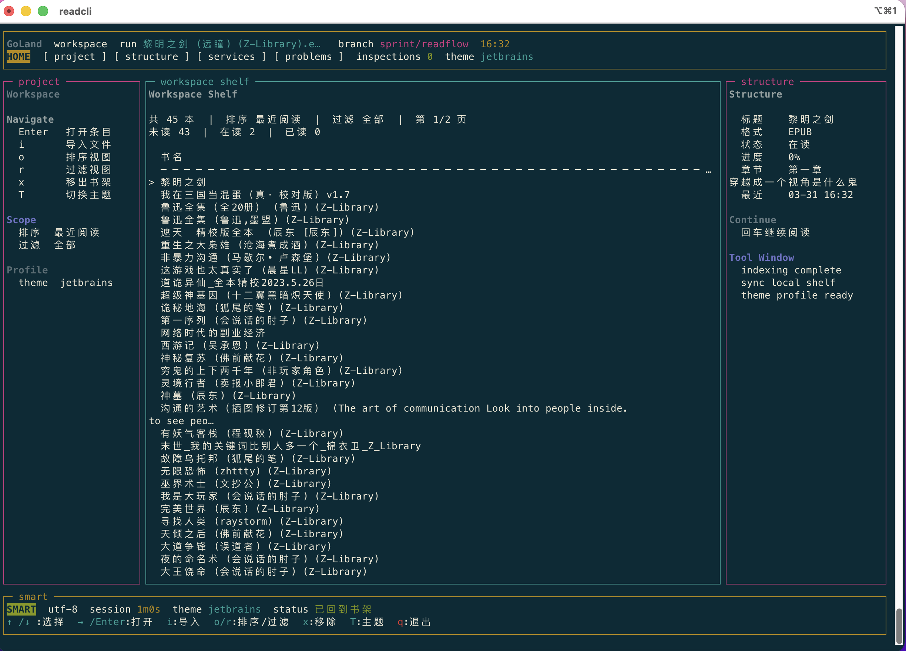
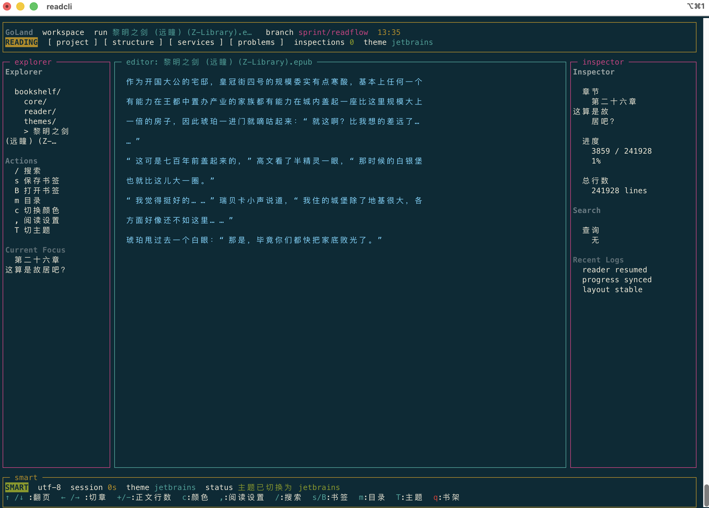
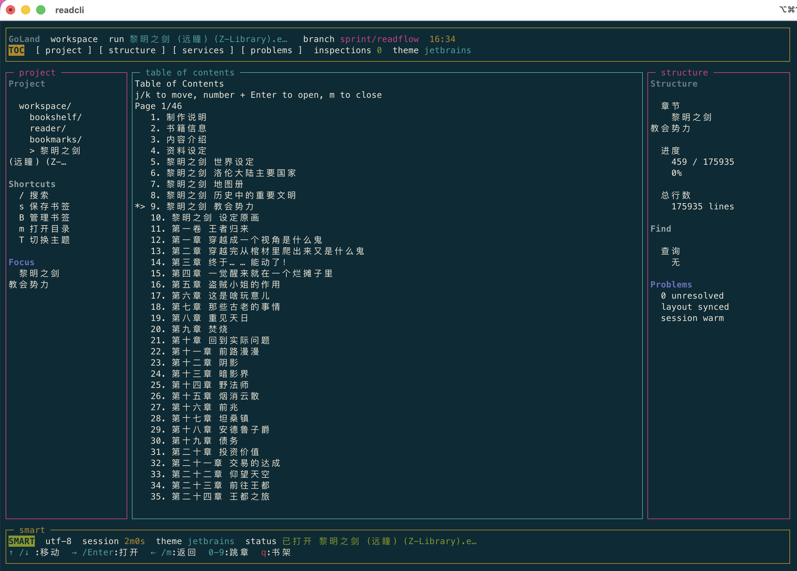
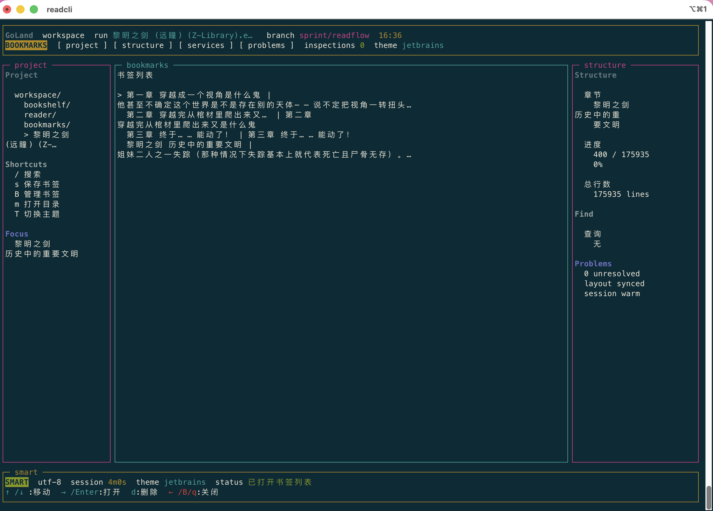
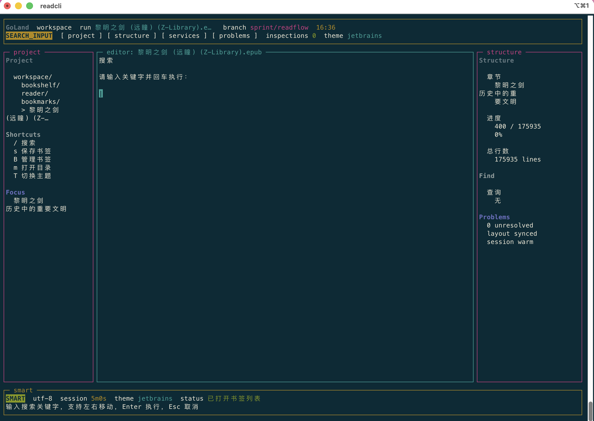
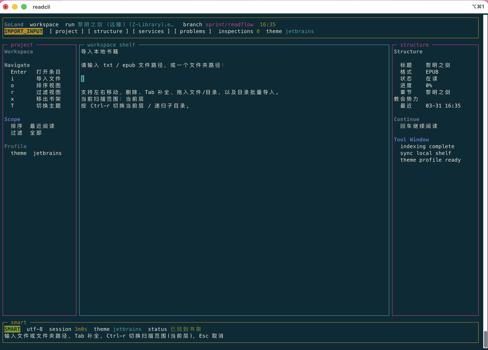

# ReadCLI

[中文说明](./README.md) | [English](./README_EN.md)

[](https://github.com/lvshp/ReadCLI/releases)
[](https://github.com/lvshp/ReadCLI/actions/workflows/go.yml)
[](./LICENSE)

ReadCLI is a terminal ebook reader with support for local `TXT` / `EPUB` and online reading through Legado sources, plus source management, login, a bookshelf, saved progress, bookmarks, search, and several IDE-style themes. Built with [tcell](https://github.com/gdamore/tcell) and [tview](https://github.com/rivo/tview), it supports macOS, Linux, and Windows.

## Screenshots

### Bookshelf



### Reading View



### Table of Contents



### Bookmarks



### Search Input



### Import Input



## Features

### Reading

* Supports `TXT`
* Supports `EPUB`
* Automatically restores the last reading position
* Chapter TOC, previous chapter, next chapter
* Full-text search for local books, current-chapter search for online books, with `n / N` result navigation
* Highlights matches on the current page
* Save, list, delete, and jump to bookmarks
* Page scrolling and configurable visible text lines per page
* Full reading UI and compact reading UI, with compact mode showing only the text, chapter, and progress
* Adjustable content width, margins, top padding, line spacing, text color, high contrast mode, basic color mode, and auto-page interval
* Reflows text based on terminal width and wide-character display width
* Reader cache with automatic invalidation by file size and modified time
* Cross-platform: macOS, Linux, Windows Terminal

### Bookshelf

* Starts in bookshelf mode when launched without arguments
* Supports importing a single book or importing from a directory
* Directory import scans only the current level by default, with optional recursive mode
* Tracks format, chapter, progress, and last read time per book
* Sort by recent activity, import time, or title
* Filter by format and reading status
* Remove from bookshelf only, or remove and delete the local file
* Main bookshelf list focuses on titles, while the right panel shows details

### UI and Interaction

* Three themes: `vscode`, `jetbrains`, `ops-console`
* Dedicated status and shortcut hints for bookshelf, reading, TOC, and bookmarks
* Press `z` in the reading view to switch between full and compact UI; the setting is saved
* Import path input supports cursor movement, `Tab` completion, candidate selection, and paging
* Drag files or directories directly into the import input
* Supports both Vim-style keys and arrow-key navigation
* Automatically checks GitHub Releases for updates on startup and shows the current version
* Manual update check, release notes preview, and in-app self-update with download progress, size, and install stage
* Boss Key support, including a custom external command
* Auto page turning
* Persists bookshelf selection, reading style, and latest reading state on exit

## Terminal Compatibility

ReadCLI is built with tcell v2, which natively supports Unicode borders and CJK character width, providing good cross-platform compatibility.

### macOS

* `iTerm2`
* `Terminal.app`
* `WezTerm`
* `Alacritty`
* `Kitty`

### Linux

* `gnome-terminal`
* `kitty`
* `wezterm`
* `alacritty`
* `xterm`
* `tmux` / `screen`

### Windows

* `Windows Terminal`
* `PowerShell` 7+ (terminal host)

The main differences come from terminal capabilities:

* Color quality depends on whether the terminal supports `256 colors` or better
* Dragging files or directories into the input box depends on the terminal emulator itself

If custom colors look dim or off in some Linux terminals, you can force basic ANSI colors in `config.json`:

```json
{
  "force_basic_color": true
}
```

## Fork Notes

This repository is based on the original project [TimothyYe/glance](https://github.com/TimothyYe/glance).

The original license and base ideas are preserved, while this fork continues active maintenance and feature work.

If you want the original project, see:
[https://github.com/TimothyYe/glance](https://github.com/TimothyYe/glance)

## Download and Install

Prebuilt binaries:

* [Releases](https://github.com/lvshp/ReadCLI/releases)

Automatic builds from `dev` are marked **Pre-release**; the stable release keeps **Latest**. Download development builds manually from Releases. In-app updates use stable releases only. See the [release guide](./CONTRIBUTING.md#发布说明) (Chinese).

Currently provided:

* macOS arm64
* macOS amd64
* Linux amd64
* Windows amd64

Build from source:

```bash
git clone https://github.com/lvshp/ReadCLI.git
cd ReadCLI
go build -o readcli ./cmd
```

Cross-compile for Windows:

```bash
GOOS=windows GOARCH=amd64 go build -o readcli.exe ./cmd
```

> Requires Go 1.24+

If the binary is already in your `PATH`, just run:

```bash
readcli
```

To use `readcli` globally, place it in `~/.local/bin` and make sure that directory is in `PATH`:

```bash
mkdir -p ~/.local/bin
cp ./readcli ~/.local/bin/readcli
echo 'export PATH="$HOME/.local/bin:$PATH"' >> ~/.zshrc
source ~/.zshrc
```

Then verify:

```bash
command -v readcli
```

Expected output:

```bash
/Users/your-name/.local/bin/readcli
```

Or open a book directly:

```bash
readcli /path/to/book.epub
readcli /path/to/book.txt
```

## Quick Start

### 1. Open the bookshelf

```bash
readcli
```

Use `i` to import books, `↑/↓` or `j/k` to move, and `→` or `Enter` to open.

### 2. Open a book directly

```bash
readcli -n 8 /path/to/book.epub
```

The book will be added to the bookshelf automatically, progress will be restored, and the reading page will start with 8 visible content lines per page.

### 3. Import files

The import input supports path completion, candidate selection, drag-and-drop, and `Ctrl-r` to toggle between current-directory-only and recursive import.

### 4. Adjust reading style

Press `,` while reading to open the reading settings panel. You can adjust:

* content width
* left / right / top / bottom margins
* line spacing
* text color
* high contrast mode
* basic color mode
* auto-page interval

Press `c` to cycle through bright preset colors.
Press `t` to toggle auto page turning.
Press `z` to switch between the full reading UI and compact reading UI. Compact mode hides the header, sidebars, and most hints, leaving the novel text, chapter title, and reading progress.

### 5. Check for updates

ReadCLI checks for updates on startup.

If you skip an update from the automatic prompt, that version will not be shown again automatically. You can still press `u` at any time to run a manual update check.

When you confirm an update, ReadCLI downloads the correct release package for the current platform and replaces the current binary. During the update it shows the download percentage, progress bar, downloaded size, and install stage. Restart the app after the update finishes.

On Windows, the new executable is staged in the installation directory first. Once the update is ready, press Enter to exit; an update helper replaces the executable after ReadCLI exits. Protected directories such as `Program Files` require administrator approval. Cancelling that approval preserves the existing executable. Failures show scrollable details and the location of recovery files. Versions 0.3.5/0.3.6 with the older updater may need one manual replacement to receive the fix for directory permissions and cross-volume updates.

### 6. Configure Boss Key

By default, pressing `b` switches to the built-in disguise page.

If you want the Boss Key to run an external command instead, set `boss_key_command` in `config.json`:

```json
{
  "boss_key_command": "genact"
}
```

You can also provide a full command with arguments.

macOS / Linux example:

```json
{
  "boss_key_command": "/usr/local/bin/genact -m terraform"
}
```

Windows example:

```json
{
  "boss_key_command": "genact.exe"
}
```

After that, pressing `b` temporarily leaves the ReadCLI UI, runs the configured command in the current terminal, and returns to ReadCLI when that command exits.

Note: The command must be installed and runnable on your system.

Recommended project:
[svenstaro/genact](https://github.com/svenstaro/genact)

## Keybindings

Press `?` to open the built-in help page. Both Vim-style keys and arrow keys are supported.

### Bookshelf

* Vim-style: `j/k` move, `Enter` open, `C` switch an online book's source, `i` import, `o/r` sort and filter, `x` remove, `u` check updates
* Arrow keys: `↑/↓` move, `→` or `Enter` open, `u` check updates

### Reading

* Vim-style: `j/k` page down/up, `[` / `]` previous/next chapter, `/` search, `n/N` next/previous result, `s/B` bookmarks, `m` TOC, `C` switch an online book's source, `c` text color, `z` compact/full UI, `u` check updates
* Arrow keys: `↑/↓` page down/up, `←/→` previous/next chapter, `z` compact/full UI, `u` check updates
* Reading settings: press `,` to adjust alignment, content width, margins, line spacing, text color, high contrast mode, basic color mode, and auto-page interval

### TOC / Bookmarks

* TOC supports direct chapter jumping by number, and the TOC titles are displayed in Chinese without the old left-side numbering
* Vim-style: `j/k` move, `Enter` open
* Arrow keys: `↑/↓` move, `→` or `Enter` open, `←` return

### General

* `+ / -` adjust visible content lines per page
* `c` cycle text color
* `T` switch theme
* `z` switch compact / full reading UI
* `u` manually check for updates
* `p` show reading progress
* `b` trigger Boss Key
* `f` show or hide borders
* `q` return to bookshelf or quit

## Data Files

Local data is stored by default in:

* macOS / Linux: `~/.readcli/`
* Windows: `%USERPROFILE%\.readcli\` (typically `C:\Users\<username>\.readcli\`)

You can also set the `READCLI_DATA_DIR` environment variable to use a custom path.

This directory contains:

* `config.json`
* `bookshelf.json`
* `bookmarks.json`
* `progress.json`
* `book_sources.json`: complete source definitions and enabled states
* `sessions.json`: source login sessions and script variables
* `online_cache/`: online book catalogs and downloaded chapters
* `replace_rules/`: editable `main.json` and separate imported cleanup rule files

Press `P` from the bookshelf, reading view, or source manager to manage online chapter cleanup rules. Use `i` to import a Legado replacement-rule JSON URL/file and `r` to reload local edits. Imports are saved separately under `replace_rules/imports/`; edit `replace_rules/main.json` for personal rules, which run last. Returning to online reading reapplies rules from the original cache while preserving approximate chapter progress. Common HTML tags in online text, including older cached chapters, are converted to readable paragraphs automatically.

Quit ReadCLI before copying the entire data directory for backup. To restore, keep the app closed, replace the directory contents with the backup, then restart. Sources, settings and reading data load automatically without importing sources again. Original local TXT / EPUB files need a separate backup. See [backup and restore](./docs/BOOK_SOURCES.md#整目录备份与恢复) (Chinese).

`config.json` stores reading-related settings such as:

* content width ratio
* margins
* Boss Key custom command
* line spacing
* auto-page interval in milliseconds
* text color (`#RRGGBB`, `#RGB`, `R,G,B`)
* `reading_alignment`: `"center"`, `"left"`, or `"right"` for the entire reading column
* `compact_mode`
* `reading_high_contrast`
* `force_basic_color`

### Reading alignment

Press `a` in the reading view to cycle center → left → right. Changes apply immediately and are saved. You can also press `,`, select 正文对齐 (alignment), and use `←/→` or `Enter`. Both full and compact modes share this setting. The entire text column moves within the left/right margins, preserving paragraph indentation, line breaks, and reading position.

To configure it manually, add `"reading_alignment": "right"` to `config.json` and restart. Set `"reading_alignment": "left"` and `"reading_margin_left": 0` to place the column at the left edge. A missing, empty, or invalid value preserves the original layout: centered in compact mode and left-aligned in full mode.

## Development

Issues and pull requests are welcome.

Related documents:

* [CHANGELOG](./CHANGELOG.md)
* [CONTRIBUTING](./CONTRIBUTING.md)
* [DEVELOPMENT_PLAN](./DEVELOPMENT_PLAN.md)

## Links

* [linux.do](https://linux.do/)

## License

This project continues to use [Apache License 2.0](./LICENSE).

## Book sources and online reading

Press `S` on the bookshelf to manage Legado JSON sources, or `s` to search enabled sources. Import a local JSON file or a direct JSON URL, toggle sources with Space, and use `L` to log in / `X` to log out. Search results support pagination; Enter opens an online book and adds it to your shelf. Chapters are loaded asynchronously and cached for offline reopening. Reading progress and bookmarks retain chapter identity. See [compatibility and usage](./docs/BOOK_SOURCES.md).

Bring your own book sources. ReadCLI does not bundle, provide, or recommend sources.

For large source libraries, use `f` to filter, `g` for groups and collections, `v` to select multiple sources, `b` for batch actions, `*` to favorite, `h` for manual checks, and `u` to undo the last management action. Imports open a preview; new sources are disabled by default, with `e` to change that choice. Reimporting preserves enabled states, favorites and local tags. Press `s` to search favorites, the filtered view, selected sources or all enabled sources.

Search requests run across up to four sources at a time. Results appear as each source finishes, with completed and failed counts. Browse or open available books while other sources are still searching. Esc cancels remaining requests and keeps existing results; changing pages, starting another search, or opening a book cancels the previous search.

Press uppercase `C` on a selected online book or while reading it to switch sources. Candidates show the source, author and latest chapter, including site information supplied by aggregate sources. Enter loads a preview of the matched chapter and reading position; Enter again confirms the replacement. The original book stays intact until confirmation. Progress and matching bookmarks migrate; unmatched bookmarks are retained and may require returning to the original source. Lowercase `c` still changes text color.
